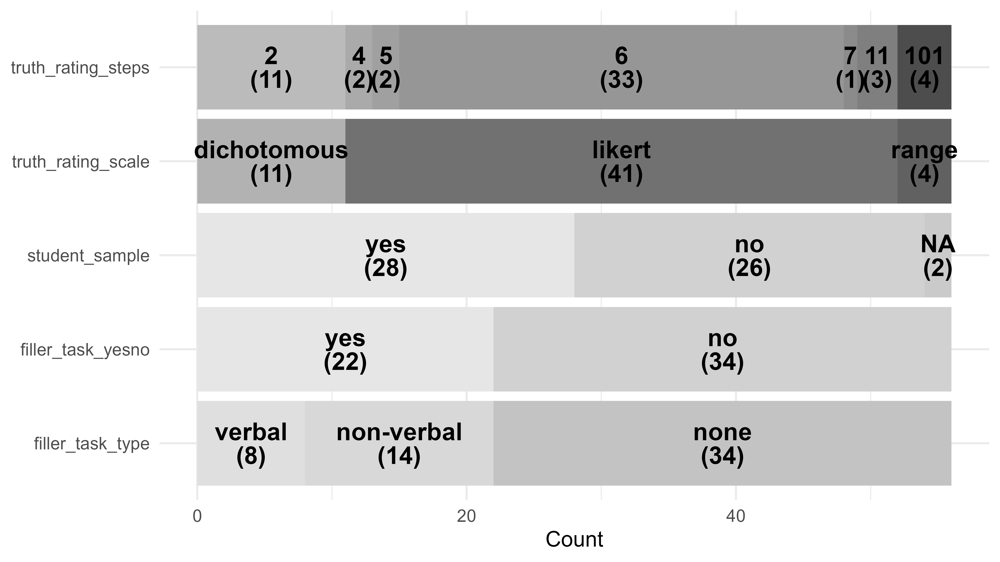
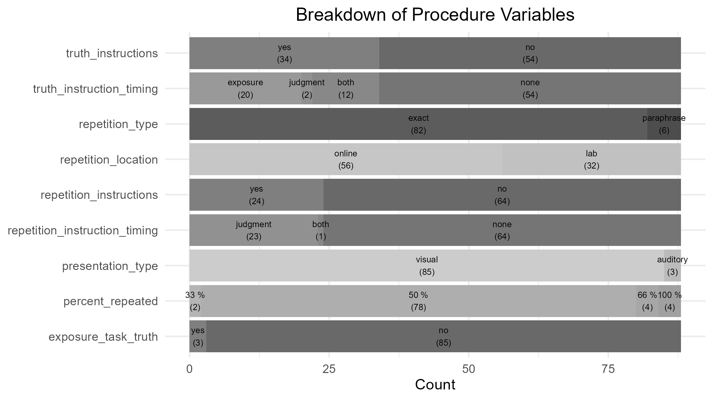
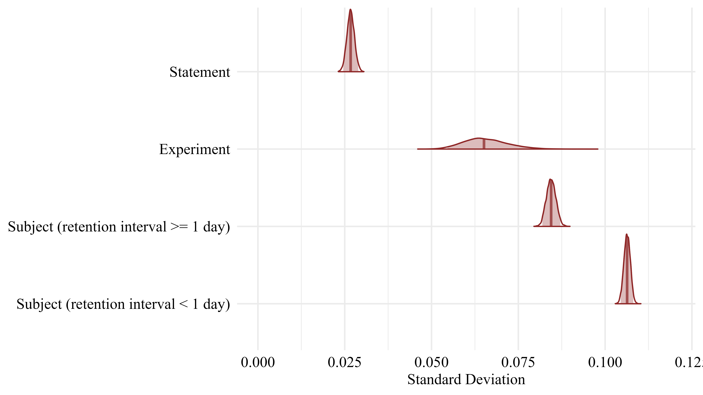

# Results
All analysis were conducted using `r r_citations$r`. `r r_citations$pkgs`.

In the current version of the manuscript, we included `r nrow(study_overview) %>% apa_num()` studies from `r nrow(publications_overview) %>% apa_num()` publications, spanning `r length(unique(full_data$subject)) %>% apa_num()` participants contributing `r nrow(full_data) %>% apa_num()` trials. A complete list of the included publications can be found in Table \@ref(tab:table-db-overview).

(ref:table-db-overview) Publications included in TED
```{r table-db-overview}
apa_table(references_table,
          caption = "Publications included in TED")
```

```{r}
age_data <- study_overview %>% 
  mutate(participant_age = ifelse(participant_age == 99, NA, participant_age)) %>% 
  filter(!is.na(participant_age), !is.na(n_participants))
```

Sample composition ranged from `r min(study_overview$n_participants, na.rm = TRUE)` to `r max(study_overview$n_participants, na.rm = TRUE)` participants. On average, studies included `r mean(study_overview$n_participants, na.rm = TRUE)` participants ($\mu_{age} =$ `r weighted.mean(age_data$participant_age, age_data$n_participants, na.rm = TRUE)`,$\sigma_{age} =$ `r DescTools::SD(age_data$participant_age, weights = age_data$n_participants, na.rm = TRUE)`). An overview of the rating scale usage for truth judgments and the use of a filler task over all included studies can be found in Figure \@ref(fig:study-overview-plot).

(ref:study-overview-plot) Overview of Study-related variables in TED
```{r study-overview-plot,  fig.cap = paste("(ref:study-overview-plot)"), out.width="90%"}

```

On average, studies employed `r mean(procedure_data$n_statements)` ($SD =$ `r sd(procedure_data$n_statements)`) statements per 
participant in the judgment session and in `r print_freq_percent(sum(procedure_data$percent_repeated == 50) / nrow(procedure_data))` of procedure settings exactly 50% of statements were repeated. Of `r nrow(procedure_data)` judgment phases, `r print_freq_percent(sum(procedure_data$repetition_time < 180) / nrow(procedure_data))` were conducted on the same day as the exposure phase. The average delay between exposure and judgment phase if both were conducted on the same day was `r procedure_data %>% filter(repetition_time < 180) %>% pull(repetition_time) %>% mean()` minutes. The average delay between exposure and judgment phase, given the judgment phase was conducted at least one day after the exposure phase, was `r round((procedure_data %>% filter(repetition_time > 180) %>% pull(repetition_time) %>% mean())/(60*24), 2)` days. An overview of additional variables pertaining to the procedure of the included studies can be found in Figure \@ref(fig:procedure-overview-plot).

<!-- An overview of the delay between exposure and judgment phase is provided in Figure \@ref(fig:delay-overview-plot).  -->

<!-- (ref:delay-overview-plot) Overview of delay between exposure and test phase -->
<!-- ```{r delay-overview-plot, fig.cap = paste("(ref:delay-overview-plot)"), out.width="100%"} -->
<!-- knitr::include_graphics("images/delay_overview_plot.png") -->
<!-- ``` -->

(ref:procedure-overview-plot) Overview of Procedure-related variables in TED
```{r procedure-overview-plot,  fig.cap = paste("(ref:procedure-overview-plot)"), out.width="100%"}

```

Detailed information on the statements presented is available for `r study_overview %>% filter(statementset_id != 1) %>% nrow()` out of `r study_overview %>% nrow()` studies. Data on the accuracy of a statement is available for `r length(analysis_data$statement_accuracy[which(!is.na(analysis_data$statement_accuracy))]) %>% apa_num` (`r (length(analysis_data$statement_accuracy[which(!is.na(analysis_data$statement_accuracy))]) / nrow(analysis_data)) %>% print_freq_percent()`) of trials, the exact statement text is available for `r length(analysis_data$statement_text[which(!is.na(analysis_data$statement_text))]) %>% apa_num` (`r (length(analysis_data$statement_text[which(!is.na(analysis_data$statement_text))]) / nrow(analysis_data)) %>% print_freq_percent()`) of trials, and response times are available for `r length(analysis_data$rt[which(!is.na(analysis_data$rt))]) %>% apa_num` (`r (length(analysis_data$rt[which(!is.na(analysis_data$rt))]) / nrow(analysis_data)) %>% print_freq_percent()`) of trials.

## Bayesian Multilevel Modeling

To illustrate the benefits of our large collection of trial-level data, we fitted Bayesian multilevel models predicting truth judgments, with repetition as a fixed effect and random intercepts and slopes at the statement, subject, and experiment levels.

The experiment level is based on data from the procedure_table, as this table contains detailed information about each experimental setup (e.g., proportion of repeated items, presence of warnings, number of sessions) beyond what is available in the broader study_table. Each entry in the study_table corresponds to at least one entry in the procedure_table, but a single study may include several procedures that differ in these settings. For example, the same study may have multiple judgment sessions, modify the percentage of repeated stimuli, or warn some participants about the truth effect. These different procedures will then also receive different procedure identifiers, but the same study identifier.

Thus, the experiment identifier (procedure_id) uniquely captures both the study context and its specific experimental conditions. This modeling approach allows us to estimate the variance in the truth effect at three levels simultaneously: (1) variance due to diverse statements (statement level), (2) variance due to individual differences (subject level), and (3) variance due to common experimental manipulations and study settings (experiment level).

We analyzed the dichotomous and Likert-type response formats separately due to differences in their scale characteristics. Dichotomous responses (e.g., true/false) require logistic models, whereas Likert-scale responses (e.g., 1–5 ratings) allow for linear models. All responses were maximum-normalized to the range 0-1 with one representing the maximum possible response indicating a “true” judgment. The repetition status was effect coded with -0.5 for new and +0.5 for repeated statements.
We ran all models using 4 chains with 3000 iterations per chain, 1000 of which were discarded as warmup-samples, leading to a total of 8000 posterior samples. There were no divergent transitions, no $\hat{R}>1.05$, and visual inspection confirmed that the chains mixed well. We used weakly informative priors for the intercept, fixed effect, and standard deviations for all models.


$$Intercept \sim Normal(0.5, 0.5)$$
$$b \sim Normal(0, 1)$$
$$\sigma \sim Gamma(1, 4)$$

### Dichotomous Truth Judgments
The analysis was based on `r nrow(dichotomous_data) %>% apa_num()` trials nested within `r length(unique(dichotomous_data$subject)) %>% apa_num()` subjects, `r length(unique(dichotomous_data$statement_id)) %>% apa_num()` statements, and `r length(unique(model_full_dichotomous_bayes$data$procedure_id)) %>% apa_num()` experiments.

Table \@ref(tab:dichotomous-model-table) provides a summary of parameter estimates.As expected, the model indicated a significant fixed effect of repetition ($b =$ `r summary_model_full_dichotomous_bayes$fixed$Estimate[2] %>% apa_num()`, $95\% \ CrI =$ `r paste0("[", summary_model_full_dichotomous_bayes$fixed[2, 3] %>% apa_num(), ", ", summary_model_full_dichotomous_bayes$fixed[2, 4] %>% apa_num(), "]")`, $OR =$ `r summary_model_full_dichotomous_bayes$fixed$Estimate[2] %>% exp() %>% apa_num()`, $BF_{10} > 1 \times 10^{10}$). Notably, the standard deviation of the random slope of repetition was highest at the subject level ($\sigma =$ `r summary_model_full_dichotomous_bayes$random$subject$Estimate[2] %>% apa_num()`, $95\% \ CrI =$ `r paste0("[", summary_model_full_dichotomous_bayes$random$subject[2, 3] %>% apa_num(), ", ", summary_model_full_dichotomous_bayes$random$subject[2, 4] %>% apa_num(), "]")`), followed by the experiment level ($\sigma =$ `r summary_model_full_dichotomous_bayes$random$procedure_id$Estimate[2] %>% apa_num()`, $95\% \ CrI =$ `r paste0("[", summary_model_full_dichotomous_bayes$random$procedure_id[2, 3] %>% apa_num(), ", ", summary_model_full_dichotomous_bayes$random$procedure_id[2, 4] %>% apa_num(), "]")`), and the statement level ($\sigma =$ `r summary_model_full_dichotomous_bayes$random$statement_id$Estimate[2] %>% apa_num()`, $95\% \ CrI =$ `r paste0("[", summary_model_full_dichotomous_bayes$random$statement_id[2, 3] %>% apa_num(), ", ", summary_model_full_dichotomous_bayes$random$statement_id[2, 4] %>% apa_num(), "]")`).

(ref:dichotomous-model-table) Variance in the truth effect at different levels

```{r dichotomous-model-table}
dichomotous_model_table <- summary_model_full_dichotomous_bayes$fixed %>% 
  mutate(Effect = "fixed",
         Parameter = row.names(.),
         Grouping = "") %>% 
  select(Effect, Grouping, Parameter, Estimate, `l-95% CI`, `u-95% CI`)

dichomotous_model_table <- rbind(dichomotous_model_table, 
                                 summary_model_full_dichotomous_bayes$random %>% 
                                   data.table::rbindlist() %>% 
                                   mutate(Grouping = c("experiment", "experiment", "statement", "statement", "subject", "subject")) %>% 
                                   mutate(Effect = "random",
                                          Parameter = rep(c("Intercept (sd)", "repeated (sd)"), 3)) %>% 
                                   select(Effect, Grouping, Parameter, Estimate, `l-95% CI`, `u-95% CI`)
) %>% 
  remove_rownames() %>% 
  rename("l_95_CrI" = "l-95% CI",
         "u_95_CrI" = "u-95% CI")

apa_table(dichomotous_model_table, 
          caption = "Parameter Estimates of the Dichotomous Model", 
          note = paste0("N = ", summary_model_full_dichotomous_bayes$nobs,
                        "; N Experiments = ", summary_model_full_dichotomous_bayes$ngrps$procedure_id,
                        "; N Subjects = ", summary_model_full_dichotomous_bayes$ngrps$subject,
                        "; N Statements = ", summary_model_full_dichotomous_bayes$ngrps$statement_id,
                        "; l_95_CrI refers to the lower boundary of the 95% credible interval, u_95_CrI refers to the upper boundary"))
```

```{r, eval = FALSE}
draws_array <- as_draws_array(model_full_dichotomous_bayes)

color_scheme_set("red")
mcmc_areas(draws_array, 
           pars = c("sd_subject__repeated", "sd_procedure_id__repeated", "sd_statement_id__repeated"),
           prob = 0.95)
```

### Scale Truth Judgments
The analysis was based on `r nrow(scale_data) %>% apa_num()` trials nested within `r length(unique(scale_data$subject)) %>% apa_num()` subjects, `r length(unique(scale_data$statement_id)) %>% apa_num()` statements, and `r length(unique(model_full_scale_bayes$data$procedure_id)) %>% apa_num()` experiments.

Table \@ref(tab:scale-model-table) provides a summary of parameter estimates. As expected, the model indicated a significant fixed effect of repetition ($b =$ `r summary_model_full_scale_bayes$fixed$Estimate[2] %>% apa_num()`, $95\% \ CrI =$ `r paste0("[", summary_model_full_scale_bayes$fixed[2, 3] %>% apa_num(), ", ", summary_model_full_scale_bayes$fixed[2, 4] %>% apa_num(), "]")`, $BF_{10} > 1 \times 10^{10}$). Again, the standard deviation of the random slope of repetition was highest at the subject level ($\sigma =$ `r summary_model_full_scale_bayes$random$subject$Estimate[2] %>% apa_num()`, $95\% \ CrI =$ `r paste0("[", summary_model_full_scale_bayes$random$subject[2, 3] %>% apa_num(), ", ", summary_model_full_scale_bayes$random$subject[2, 4] %>% apa_num(), "]")`), followed by the experiment level ($\sigma =$ `r summary_model_full_scale_bayes$random$procedure_id$Estimate[2] %>% apa_num()`, $95\% \ CrI =$ `r paste0("[", summary_model_full_scale_bayes$random$procedure_id[2, 3] %>% apa_num(), ", ", summary_model_full_scale_bayes$random$procedure_id[2, 4] %>% apa_num(), "]")`), and the statement level ($\sigma =$ `r summary_model_full_scale_bayes$random$statement_id$Estimate[2] %>% apa_num()`, $95\% \ CrI =$ `r paste0("[", summary_model_full_scale_bayes$random$statement_id[2, 3] %>% apa_num(), ", ", summary_model_full_scale_bayes$random$statement_id[2, 4] %>% apa_num(), "]")`).


(ref:scale-model-table) Variance in the truth effect at different levels
```{r scale-model-table}
scale_model_table <- summary_model_full_scale_bayes$fixed %>% 
  mutate(Effect = "fixed",
         Parameter = row.names(.),
         Grouping = "") %>% 
  select(Effect, Grouping, Parameter, Estimate, `l-95% CI`, `u-95% CI`)

scale_model_table <- rbind(scale_model_table, 
                                 summary_model_full_scale_bayes$random %>% 
                                   data.table::rbindlist() %>% 
                                   mutate(Grouping = c("experiment", "experiment", "statement", "statement", "subject", "subject")) %>% 
                                   mutate(Effect = "random",
                                          Parameter = rep(c("Intercept (sd)", "repeated (sd)"), 3)) %>% 
                                   select(Effect, Grouping, Parameter, Estimate, `l-95% CI`, `u-95% CI`)
) %>% 
  remove_rownames() %>% 
  rename("l_95_CrI" = "l-95% CI",
         "u_95_CrI" = "u-95% CI")

apa_table(scale_model_table, caption = "Parameter Estimates of the Scale Model", 
          note = paste0("N = ", summary_model_full_scale_bayes$nobs,
                        "; N Procedure = ", summary_model_full_scale_bayes$ngrps$procedure_id,
                        "; N Subjects = ", summary_model_full_scale_bayes$ngrps$subject,
                        "; N Statements = ", summary_model_full_scale_bayes$ngrps$statement_id,
                        "; l_95_CrI refers to the lower boundary of the 95% credible interval, u_95_CrI refers to the upper boundary"))
```

```{r, eval = FALSE}
draws_array <- as_draws_array(model_full_scale_bayes)

color_scheme_set("red")
mcmc_areas(draws_array, 
           pars = c("sd_subject__repeated", "sd_procedure_id__repeated", "sd_statement_id__repeated"),
           prob = 0.95)
```

As outlined above in the introduction, previous research findings suggest that the time interval between exposure and judgment phase may be a crucial factor in investigating the role of individual differences in the truth effect. To further explore the influence of temporal delay between the exposure and judgment phases on inter-individual variability in the repetition effect, we included an interaction between subject and temporal delay (same-day vs. different day) in the random effect structure. The model then estimates two standard distributions for the random effect of repetition on the subject level. Based on this, we examined whether variability in the repetition effect at the subject-level differ depending on the temporal delay.

Table \@ref(tab:time-model-table) provides a summary of parameter estimates. The standard deviation of the random slope of repetition at the subject level for a same-day judgment phase was $\sigma_0 =$ `r mean(sd_1) %>% apa_num()` ($95\% \ CrI =$ `r paste0("[", quantile(sd_1, 0.025) %>% apa_num(), ", ", quantile(sd_1, 0.975) %>% apa_num(), "]")`). The standard deviation for the random slope on a later day judgment phase was $\sigma_1 =$ `r mean(sd_0) %>% apa_num()` ($95\% \ CrI =$ `r paste0("[", quantile(sd_0, 0.025) %>% apa_num(), ", ", quantile(sd_0, 0.975) %>% apa_num(), "]")`). The difference in standard deviations in the random effect of repetition at the subject level deviated substantially from zero $\sigma_0 - \sigma_1 =$ `r mean(sd_diff) %>% apa_num()` ($95\% \ CrI =$ `r paste0("[", quantile(sd_diff, 0.025) %>% apa_num(), ", ", quantile(sd_diff, 0.975) %>% apa_num(), "]")`, $BF_{10} > 1 \times 10^{10}$).

(ref:time-model-table) Variance in the truth effect at different levels
```{r time-model-table}
time_model_table <- summary_model_time_scale_bayes$fixed %>% 
  mutate(Effect = "fixed",
         Parameter = row.names(.),
         Grouping = "") %>% 
  select(Effect, Grouping, Parameter, Estimate, `l-95% CI`, `u-95% CI`)

time_model_table <- rbind(time_model_table, 
                                 summary_model_time_scale_bayes$random %>% 
                                   data.table::rbindlist() %>% 
                                   mutate(Grouping = c("experiment", "experiment", "statement", "statement", "subject", "subject")) %>% 
                                   mutate(Effect = "random",
                                          Parameter = rep(c("Intercept (sd)", "repeated (sd)"), 3)) %>% 
                                   select(Effect, Grouping, Parameter, Estimate, `l-95% CI`, `u-95% CI`) %>% 
                            filter(Grouping != "subject")
) %>% 
  remove_rownames() %>% 
  rename("l_95_CrI" = "l-95% CI",
         "u_95_CrI" = "u-95% CI")

time_model_table <- rbind(time_model_table,
                          data.frame(
                            Effect = rep("random", 4),
                            Grouping = c("subject (same day)", "subject (same day)", "subject (>= 1 day)", "subject (>= 1 day)"),
                            Parameter = rep(c("Intercept (sd)", "repeated (sd)"), 2),
                            Estimate = c(mean(intercept_1), mean(sd_1), mean(intercept_0), mean(sd_0)),
                            `l_95_CrI` = c(quantile(intercept_1, 0.025), quantile(sd_1, 0.025), quantile(intercept_0, 0.025), quantile(sd_0, 0.025)),
                            `u_95_CrI` = c(quantile(intercept_1, 0.975), quantile(sd_1, 0.975), quantile(intercept_0, 0.975), quantile(sd_0, 0.975))
                          ))

apa_table(time_model_table, caption = "Parameter Estimates of the Time-based Scale Model", 
          note = paste0("N = ", summary_model_time_scale_bayes$nobs,
                        "; N Procedure = ", summary_model_time_scale_bayes$ngrps$procedure_id,
                        "; N Subjects = ", summary_model_time_scale_bayes$ngrps$subject,
                        "; N Statements = ", summary_model_time_scale_bayes$ngrps$statement_id,
                        "; l_95_CrI refers to the lower boundary of the 95% credible interval, u_95_CrI refers to the upper boundary"))
```

(ref:time-model-plot) Variance in the truth effect at different levels
```{r time-model-plot,  fig.cap = paste("(ref:time-model-plot)"), out.width="100%"}
post <- as_draws_df(model_time_scale_bayes)

sd_statement <- post$sd_statement_id__repeated
sd_procedure <- post$sd_procedure_id__repeated

sd_matrix <- cbind(
  sd_1,
  sd_0,
  sd_procedure,
  sd_statement
)
color_scheme_set("red")

sd_posterior_plot <- mcmc_areas(
  sd_matrix,
  prob = 0.95,      # 95% credible interval
  prob_outer = 1,
  border_size = 1,
  point_est = "median") +
  xlim(0, 0.12)+
  xlab("Standard Deviation") +
  # ylab("Level") +
  scale_y_discrete(
    labels = c(
      "sd_1"= "Subject (retention interval < 1 day)",
      "sd_0" = "Subject (retention interval >= 1 day)",
      "sd_procedure" = "Procedure",
      "sd_statement" = "Statement"
    )
  )+
  theme_minimal(base_family = "Times New Roman", base_size = 25) +
  theme(
    text = element_text(family = "Times New Roman", colour = "black"),
    axis.text = element_text(family = "Times New Roman", size = 25, color = "black"),
    axis.title = element_text(family = "Times New Roman", size = 25, color = "black"),
    legend.text = element_text(family = "Times New Roman"),
    legend.title = element_text(family = "Times New Roman")
  )

ggsave("markdown/images/sd_posterior_plot.png", sd_posterior_plot, width = 16, height = 9)

```


